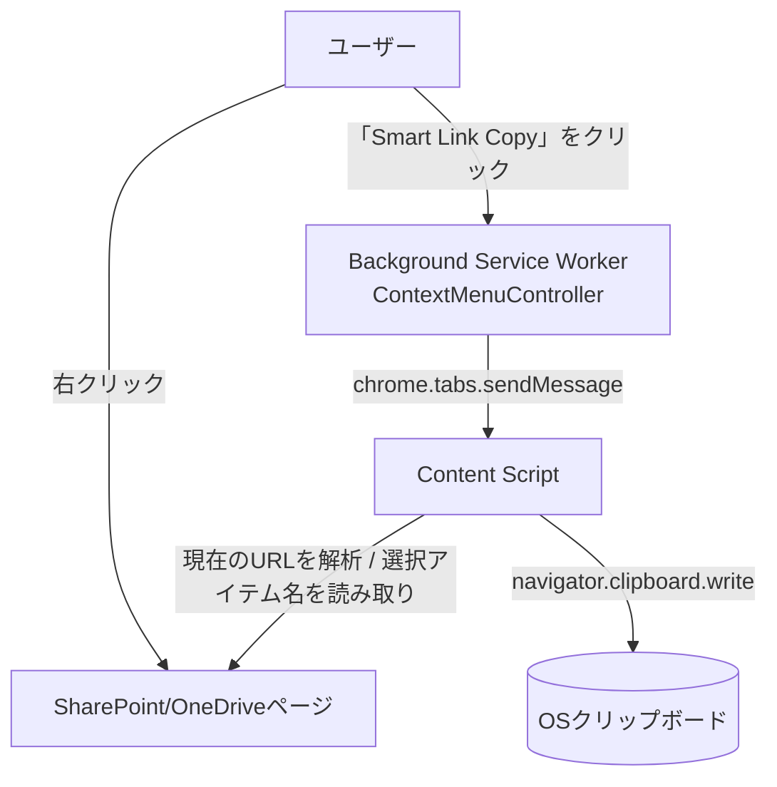
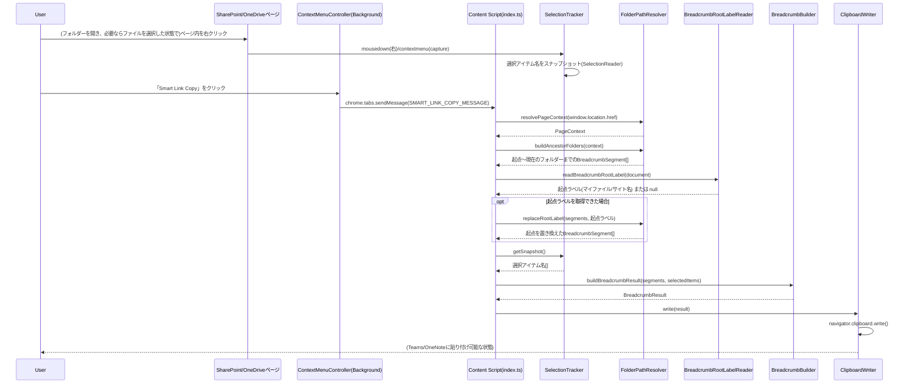
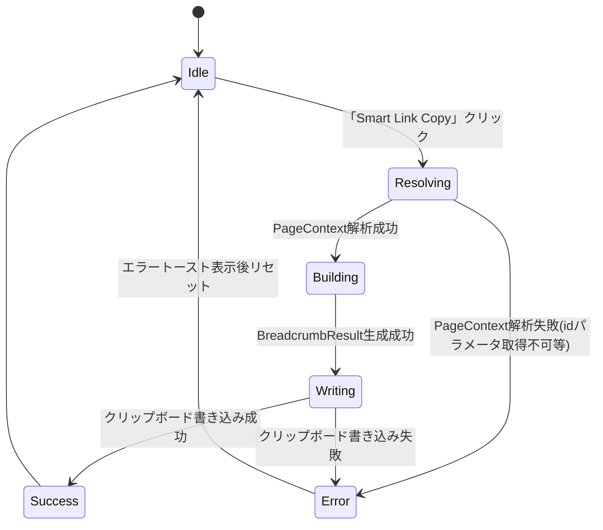

# 機能設計書 (Functional Design Document)

## システム構成図



- バックエンドサーバー・API連携は存在しない(Microsoft 365認証・Graph API等は使用しない)
- すべての処理はブラウザ内(Content Script / Background Service Worker)で完結する
- **右クリックされたDOM要素(ファイル/フォルダー行)は一切見ない**。詳細は下記「設計方針の変更」を参照

### 設計方針の変更(実機検証による)

当初は右クリックされたファイル/フォルダー行をDOM解析で特定し、そのファイル/フォルダーの階層を
コピーする設計だった。しかし実機検証の結果、以下の問題が判明した。

1. SharePoint/OneDriveは、ファイル/フォルダー行の右クリックに対して**独自のコンテキストメニュー**を表示し、
   ブラウザ標準のコンテキストメニュー(拡張機能が追加するメニュー項目を含む)を`event.preventDefault()`等で
   抑制する。そのため、拡張機能のメニュー項目は行の上ではほぼ表示されない
2. ページの空白部分など、SharePoint/OneDriveが独自メニューを出さない場所では拡張機能のメニューが表示されるが、
   その場合「何を右クリックしたか」をDOMから正しく判定することは困難で、無関係なUI要素
   (ストレージ容量アップグレードのバナー等)のテキストを誤って抽出する不具合が発生した

これを受けて、**「右クリックした対象」を特定する設計をやめ、「現在アドレスバーに表示されているフォルダー」を
常にコピー対象とする**方式に変更した。ユーザーは共有したいフォルダーを開いた状態でページ内を右クリックし、
「Smart Link Copy」を選択するだけでよい。

### 選択アイテム一覧の追加(限定的なDOM読み取りの再導入)

ファイルを共有したいというニーズに応えるため、「現在のフォルダーのパンくず」に加えて「選択されているアイテム名」を
パンくずの下に列挙してコピーする。この機能では再びDOMを読み取るが、以下の点で前述の問題を回避している。

- 読み取るのは「右クリックされた対象」ではなく「**選択状態**(`aria-selected="true"`の行)」であり、
  独自コンテキストメニューの有無に依存しない(選択はユーザーが左クリック/チェックボックスで行う)
- 右クリック操作でSharePoint/OneDrive側が選択を解除する可能性があるため、右クリックの`mousedown`/
  `contextmenu`イベント(captureフェーズ、ページ側の処理より前)の時点で選択名を**スナップショット**し、
  コピー時はそのスナップショットを使う
- DOM構造が想定外で名前を取得できない場合は例外にせず「選択なし」として扱い、パンくずのみを従来通りコピーする
  (誤ったテキストを出力するより、何も付け足さない方を優先する)
- 読み取り対象を選択行の内側に限定し、ページ内の無関係な要素(バナー等)のテキストは拾わない

ファイル自体へのリンク付与はPost-MVPとする(ファイルの実リンクはURLから構築できないため。
`docs/product-requirements.md`のPost-MVPセクション参照)。

## 技術スタック

| 分類 | 技術 | 選定理由 |
|------|------|----------|
| 言語 | TypeScript 5.x | 既存リポジトリの技術スタックに合わせる。DOM操作・型安全性を両立 |
| 拡張機能仕様 | Chrome Extension Manifest V3 | 現行Chromeで新規拡張機能を作成する場合の標準仕様 |
| バックグラウンド処理 | Service Worker (`background.ts`) | Manifest V3ではPersistent BackgroundではなくService Workerが必須 |
| ページ内処理 | Content Script | SharePoint/OneDriveページのURLへアクセスするために必要 |
| クリップボード操作 | Clipboard API (`navigator.clipboard.write`) | リッチテキスト(HTML)と プレーンテキストを同時に書き込むために必要 |
| テスト | Vitest | 既存リポジトリのテスト基盤をそのまま利用 |
| ビルド | tsc (既存の`npm run build`) | 追加のバンドラー導入は初期スコープでは行わず、シンプルに保つ |

## データモデル定義

### エンティティ: BreadcrumbSegment

パンくずを構成する1つの区切りセグメント(起点ラベル/フォルダー名)を表す。

```typescript
interface BreadcrumbSegment {
  label: string;      // 表示名(フォルダー名、または起点ラベル)
  url: string | null; // リンク先URL。null の場合はプレーンテキスト表示(起点セグメントのみ)
}
```

**制約**:
- `label` は空文字にならない
- 起点セグメント(先頭)は必ず `url: null`
- 起点以外のフォルダーセグメント(現在表示しているフォルダー自身を含む)は必ず `url` に実際のフォルダーURLを持つ

### エンティティ: PageContext

現在のページURLから読み取れる情報を表す。

```typescript
type SiteType = 'onedrive-personal' | 'sharepoint-site';

interface PageContext {
  siteType: SiteType;
  origin: string;        // 例: https://onedrive.live.com
  pathname: string;       // 例: /my
  idParam: string;        // URLの id クエリパラメータをデコードした値(フォルダーパス)
  viewId?: string;        // OneDriveの viewid など、URL再構築時に引き継ぐ追加パラメータ
}
```

### エンティティ: BreadcrumbResult

クリップボードに書き込む最終的な内容。

```typescript
interface BreadcrumbResult {
  segments: BreadcrumbSegment[];
  selectedItems: string[]; // 選択アイテム名(表示順)。0件なら空配列
  html: string;  // クリップボードに書き込むHTML文字列(text/html)
  text: string;  // クリップボードに書き込むプレーンテキスト(text/plain、リンク情報なし)
}
```

**制約**:
- 1行目(パンくず)の`text`は `segments` の `label` を ` > ` (半角スペース+`>`+半角スペース)で連結したもの
- 1行目(パンくず)の`html`は `segments` の各要素を、`url`があれば`<a href="...">label</a>`、無ければエスケープ済みテキストとして、` > ` で連結したもの
- `selectedItems`が1件以上ある場合、2行目以降を追加する(下記「出力フォーマット仕様」参照)

### 出力フォーマット仕様

| 項目 | 内容 |
|------|------|
| 1行目 | 現在のフォルダーのパンくず(従来通り) |
| 2行目以降 | 選択アイテム1件につき1行。行頭に`　┗ `(全角スペース U+3000 + `┗` U+2517 + 半角スペース)、続けてアイテム名 |
| アイテム名 | リンクなし。HTML出力ではエスケープする |
| 順序 | 画面上の表示順(DOM順) |
| 0件のとき | 2行目以降を出力しない(末尾に改行も付けない) |
| plain text | 行区切りは`\n` |
| HTML | 行区切りは`<br>`(Teams/OneNoteへの貼り付けで改行が維持されることを実機で確認する) |

出力例(plain text):

```
マイファイル > ◆自己紹介 > 20250108_トリセツ
　┗ 20231122_近況報告_DED_山田太郎.pptx
　┗ Cropped_Image.png
```

## コンポーネント設計

### ContextMenuController(Background Service Worker)

**責務**:
- 拡張機能インストール時に「Smart Link Copy」コンテキストメニューを登録する(表示対象は SharePoint/OneDrive のドキュメントURLのみに限定する)
- メニュークリック(`chrome.contextMenus.onClicked`)を検知し、対象タブの Content Script にコピー処理の実行を指示する

**インターフェース**:
```typescript
class ContextMenuController {
  registerMenu(): void;
  handleMenuClicked(info: chrome.contextMenus.OnClickData, tab: chrome.tabs.Tab): void;
}
```

**依存関係**:
- `chrome.contextMenus` API
- `chrome.tabs.sendMessage` API (Content Scriptへの処理実行指示)
- `chrome.scripting.executeScript` API (`sendMessage`失敗時の自己修復。`docs/architecture.md`の
  「Manifest V3のパーミッション設計」参照)

### FolderPathResolver(Content Script)

**責務**:
- 現在のアドレスバーURL(`window.location.href`)を解析し、`PageContext` を生成する
- `PageContext` から、起点(トップフォルダー)〜現在のフォルダーまでの階層一覧(名前 + 実URL)を構築する
  (現在のフォルダー自身も最後のセグメントとして含む)

**インターフェース**:

DOM/Chrome APIに依存しない純粋なURL文字列処理のみのため、クラスではなく関数として実装する
(`docs/development-guidelines.md`の「必要以上の抽象化を避ける」方針に基づく判断)。

```typescript
function resolvePageContext(url: string): PageContext | null;
function buildAncestorFolders(context: PageContext): BreadcrumbSegment[]; // 起点〜現在のフォルダーまでの全階層
function replaceRootLabel(segments: BreadcrumbSegment[], label: string): BreadcrumbSegment[]; // 起点セグメントのラベルのみ置き換える(urlはnullのまま)
```

**依存関係**: なし(URL文字列処理のみ)

### BreadcrumbRootLabelReader(Content Script)

**責務**:
- OneDrive/SharePointページ自身が表示しているパンくずUI(Fluent UI製。`[data-automationid="breadcrumb-crumb"]`で
  各階層の要素を特定できる、実機のDOMキャプチャで確認済みの安定した自動化属性)から、先頭(文書順で最初)の
  要素のラベルを読み取る。OneDriveでは「マイファイル」、SharePointではサイト名がここに表示される
- URLの`id`パラメータにはSharePointのサイト名そのものが含まれないため(ドキュメントライブラリ名までしか
  分からない)、DOMから読み取る必要がある
- 先頭の`[data-automationid="breadcrumb-crumb"]`要素の内側にある`[title]`要素のtitle属性を優先し、
  無ければテキストをそのまま使う
- 取得したテキストは空白を正規化(trim)する。DOM構造が想定外でも例外を投げず、`null`を返す

**インターフェース**:
```typescript
function readBreadcrumbRootLabel(root: ParentNode): string | null;
```

**依存関係**: OneDrive/SharePointのパンくずUIのDOM構造(`data-automationid`属性)。実機のDOMキャプチャに基づいて
実装しているが、Microsoft側のUI変更の影響は受けうる。取得に失敗した場合は、起点はURLベースの値
(マイファイル、またはドキュメントライブラリ名)のままになる(`FolderPathResolver.buildAncestorFolders`の
デフォルト動作へフォールバックする)

### SelectionReader(Content Script)

**責務**:
- ページ内で選択されているアイテム(ファイル/フォルダー)の名前を、画面上の表示順に読み取る
- 読み取りは選択行(`[role="row"][aria-selected="true"]`、フォールバックとして`[data-selection-index][aria-selected="true"]`。
  ヘッダー行は除外、入れ子の重複は最外殻のみ)の内側に限定する
- 名前の取得は次の優先順: (1) 名前用の既知の属性を持つ要素(`data-automationid`が`field-LinkFilename`/`field-displayName`/
  `FieldRenderer-name`/`name`、`data-automation-key="displayName"`)のテキスト → (2) テキストを持つ最初の`[role="gridcell"]`のテキスト
  (拡張子が別要素に分かれていても連結して取得できる) → (3) 行内の最初の非空テキストノード
- 空白を正規化して空を除外し、重複を除去する。DOM構造が想定外でも例外を投げず、空配列を返す

**インターフェース**:
```typescript
function readSelectedItemNames(root: ParentNode): string[];
```

**依存関係**: SharePoint/OneDriveのDOM構造(`aria-selected`、`role`属性等)。UI変更の影響を受けやすいため、
フォールバックを多段にし、失敗時は選択なし扱いとする

### SelectionTracker(Content Script)

**責務**:
- 右クリック直前の選択状態をスナップショットとして保持する(右クリックでページ側が選択を解除しても、
  解除前の選択を使うため)
- `mousedown`(`button === 2`)のcaptureフェーズで選択名を`pendingSnapshot`に保存し、続く`contextmenu`のcapture
  フェーズで`lastSnapshot`として確定する(`mousedown`が無い経路(Ctrl+クリック等)では`contextmenu`時点の選択を読む)

**インターフェース**:
```typescript
class SelectionTracker {
  attach(doc?: Document): void;
  getSnapshot(): string[] | null; // まだ右クリックされていなければ null
}
```

**依存関係**: `SelectionReader`

### BreadcrumbBuilder(Content Script)

**責務**:
- `FolderPathResolver.buildAncestorFolders` が構築した階層(`BreadcrumbSegment[]`)と選択アイテム名を、
  `BreadcrumbResult`(HTML/プレーンテキスト)に変換する。対象の特定・セグメントの追加は一切行わない
- 選択アイテムがある場合、上記「出力フォーマット仕様」に従って2行目以降を追加する

**インターフェース**:

こちらも`FolderPathResolver`と同様、DOM/Chrome APIに依存しない純粋関数として実装する。

```typescript
function buildBreadcrumbResult(segments: BreadcrumbSegment[], selectedItems?: string[]): BreadcrumbResult;
```

**依存関係**: なし(純粋なデータ変換処理)

### ClipboardWriter(Content Script)

**責務**:
- `BreadcrumbResult` をクリップボードに書き込む(`text/html` と `text/plain` の両方)

**インターフェース**:
```typescript
class ClipboardWriter {
  write(result: BreadcrumbResult): Promise<void>;
}
```

**依存関係**: `navigator.clipboard` API

## ユースケース図

### Smart Link Copyの実行



**フロー説明**:
1. ユーザーは共有したいフォルダーを開き、(必要なら)共有したいアイテムを選択した状態で、ページ内(右クリックした対象は問わない)を右クリックする
2. 右クリックの`mousedown`/`contextmenu`(captureフェーズ)で、`SelectionTracker`が選択アイテム名をスナップショットする
3. ユーザーが「Smart Link Copy」をクリックすると、Background経由でContent Script側の処理が起動する
4. `FolderPathResolver` が現在のURLから `PageContext` を解析し、起点〜現在のフォルダーまでの階層を構築する
5. `BreadcrumbRootLabelReader` がページ自身のパンくずUIから起点ラベル(OneDriveなら「マイファイル」、
   SharePointならサイト名)を読み取り、取得できれば `FolderPathResolver.replaceRootLabel` で起点セグメントを
   置き換える(取得できなければURLベースの値のまま)
6. スナップショット(未取得なら現在の選択)から選択アイテム名を取得する
7. `BreadcrumbBuilder` が階層情報と選択アイテム名を `BreadcrumbResult`(HTML/プレーンテキスト)に変換する
8. `ClipboardWriter` がクリップボードへ書き込む
9. ユーザーはTeams/OneNoteに貼り付けて共有する

## コピー処理の状態遷移



## API設計

該当なし。バックエンドサーバー・外部APIとの通信は行わない(Microsoft 365 / Graph API連携はスコープ外)。

## アルゴリズム設計

### フォルダー階層の構築(FolderPathResolver)

**目的**: 現在のアドレスバーURLから、起点(トップフォルダー)〜現在のフォルダーまでの各階層について、名前とリンク先URLを構築する

**計算ロジック**:

#### ステップ1: サイト種別の判定
- ホスト名が `onedrive.live.com` → `siteType = 'onedrive-personal'`
- ホスト名が `*.sharepoint.com` → `siteType = 'sharepoint-site'`
- どちらにも一致しない場合 → 解析失敗(`null`)を返す(コンテキストメニュー自体、`documentUrlPatterns`で非表示にするため通常到達しない)

#### ステップ2: idクエリパラメータのデコードと分割
- URLの `id` クエリパラメータを取得し、URLデコードする
- `/` 区切りでパスセグメント配列に分割する
  - 例: `/personal/00d5c5517f1d115b/Documents/■勉強会資料/_old` →
    `['personal', '00d5c5517f1d115b', 'Documents', '■勉強会資料', '_old']`
- `id` パラメータが存在しない場合 → 解析失敗(`null`)を返す

#### ステップ3: 起点セグメントの決定とパスの正規化
- `siteType = 'onedrive-personal'` の場合:
  - 先頭3セグメント(`personal`, `<ユーザーID>`, `Documents`)をスキップする(個人OneDriveの`Documents`は実際の階層としてユーザーに見せない)
  - 起点ラベルは固定文字列 `マイファイル`(リンクなし)
  - 残りのセグメント(`Documents`より後ろ、現在のフォルダー自身を含む)を階層に含める
- `siteType = 'sharepoint-site'` の場合:
  - 起点ラベルはドキュメントライブラリ名(pathnameの`Forms`セグメントの直前から特定。見つからない場合は
    idパラメータの先頭セグメントをフォールバックとして使う)
  - 起点より前のサイトパス部分(`sites/<サイト名>` 等)はパンくずに含めない

#### ステップ4: 各階層のURL再構築
- 起点より後ろの各セグメント(現在のフォルダー自身を含む)について、先頭からそのセグメントまでを連結した
  部分パスを作り、現在の `origin + pathname` に対して `id` クエリパラメータを当該部分パスに差し替えたURLを生成する
- `viewid` 等、`id` 以外の既存クエリパラメータは元のURLの値をそのまま引き継ぐ
- 生成したURLを、そのセグメントの `BreadcrumbSegment.url` とする

#### ステップ5: 起点ラベルのパンくずUIラベルへの置き換え
- ステップ3で決定した起点ラベル(SharePointの場合はドキュメントライブラリ名)は、同じ名前
  (「Shared Documents」等)が複数のSharePointサイトで重複しやすく、どのサイトか分かりにくい
- `BreadcrumbRootLabelReader.readBreadcrumbRootLabel(document)` で、ページ自身のパンくずUIの先頭要素
  (OneDriveなら「マイファイル」、SharePointならサイト名)を読み取り、取得できれば
  `replaceRootLabel(segments, 取得したラベル)` で起点ラベルを置き換える(`url`は`null`のまま変更しない)
- 取得できない場合(DOM構造が想定外等)は、ステップ3のURLベースの起点ラベルのままにする
  (パンくずのコピー自体は失敗させない)

**実装例**:
```typescript
function resolvePageContext(url: string): PageContext | null {
  const parsed = new URL(url);
  const idParam = parsed.searchParams.get('id');
  if (!idParam) return null;

  const siteType: SiteType | null = parsed.hostname === 'onedrive.live.com'
    ? 'onedrive-personal'
    : parsed.hostname.endsWith('.sharepoint.com')
      ? 'sharepoint-site'
      : null;
  if (!siteType) return null;

  return {
    siteType,
    origin: parsed.origin,
    pathname: parsed.pathname,
    idParam: decodeURIComponent(idParam),
    viewId: parsed.searchParams.get('viewid') ?? undefined,
  };
}

function buildAncestorFolders(context: PageContext): BreadcrumbSegment[] {
  const segments = context.idParam.split('/').filter(Boolean);

  const { rootLabel, folderSegments } = context.siteType === 'onedrive-personal'
    ? { rootLabel: 'マイファイル', folderSegments: segments.slice(3) } // personal/<userId>/Documents をスキップ
    : { rootLabel: segments[0], folderSegments: segments.slice(1) };  // 先頭をライブラリ名として起点に

  const result: BreadcrumbSegment[] = [{ label: rootLabel, url: null }];

  const basePathSegments = context.siteType === 'onedrive-personal'
    ? segments.slice(0, 3)
    : segments.slice(0, 1);

  folderSegments.forEach((name, index) => {
    const partialPath = [...basePathSegments, ...folderSegments.slice(0, index + 1)].join('/');
    const link = new URL(context.origin + context.pathname);
    // URLSearchParams.set() は値を自身でパーセントエンコードするため、ここで
    // encodeURIComponent() を重ねて呼ぶと二重エンコード(%2F → %252F)になる(実際に発生した不具合)。
    // デコード済みの生の文字列をそのまま渡す。
    link.searchParams.set('id', '/' + partialPath);
    if (context.viewId) link.searchParams.set('viewid', context.viewId);

    result.push({ label: name, url: link.toString() });
  });

  return result;
}
```

## UI設計

拡張機能自体は専用の画面を持たない。ユーザーへのフィードバックは以下の2箇所のみ。

### コンテキストメニュー項目

| 項目 | 説明 |
|------|------|
| メニュー名 | `Smart Link Copy` |
| 表示条件 | SharePoint/OneDriveのドキュメントページ上での右クリック(対象要素は問わない。`contexts: ['all']`) |

**既知の制約**: SharePoint/OneDriveは、ファイル/フォルダー行の右クリックに対して独自のコンテキストメニューを表示し、
ブラウザ標準のコンテキストメニュー(拡張機能のメニュー項目を含む)を抑制することがある。この場合、
「Smart Link Copy」はそもそも表示されない。これは拡張機能側では制御できないMicrosoft側のUI仕様による制約であり、
ページ内の空白部分など、独自メニューが介入しない場所で右クリックすることを前提としたユーザーガイドとする
(`README.md`参照)。

### エラートースト(簡易通知)

処理に失敗した場合、ページ右下等に数秒間表示される簡易な通知(DOM要素を動的に挿入する軽量な実装。専用UIフレームワークは導入しない)。

| 状態 | 表示メッセージ例 |
|------|-----------------|
| 成功 | (トースト表示は行わず、クリップボードへの書き込みのみで完結させる) |
| 失敗 | 「Smart Link Copyに失敗しました。もう一度お試しください」 |

## ファイル構造

該当なし(具体的なディレクトリ構成は `docs/repository-structure.md` で定義する)。

## パフォーマンス最適化

- URL解析・パンくず構築処理は文字列操作のみで完結させ、DOM走査やネットワークリクエストを発生させない

## セキュリティ考慮事項

- Microsoft 365の認証情報・アクセストークンは一切取得・保持・送信しない
- 拡張機能が生成するHTML文字列は、URLから取得したフォルダー名およびDOMから取得した選択アイテム名をそのままHTMLに埋め込むため、XSS対策として `<`, `>`, `&`, `"` 等のHTML特殊文字を必ずエスケープしてから埋め込む
- 外部サーバーへの通信を一切行わない(すべてローカル処理)

## エラーハンドリング

### エラーの分類

| エラー種別 | 処理 | ユーザーへの表示 |
|-----------|------|-----------------|
| URLの`id`パラメータが取得できない/想定外形式 | 処理を中断し、クリップボードは変更しない | 「フォルダー階層を取得できませんでした」 |
| クリップボードへの書き込み失敗(権限拒否等) | 処理を中断 | 「Smart Link Copyに失敗しました。もう一度お試しください」 |
| SharePoint/OneDrive以外のページ | そもそもコンテキストメニュー項目を表示しない(`documentUrlPatterns`で制御) | 表示なし |
| ファイル/フォルダー行の右クリック | SharePoint/OneDrive自身の独自メニューにブラウザメニューごと抑制され、拡張機能側では検知できない(既知の制約) | 表示なし |
| 選択アイテム名を取得できない(DOM構造が想定外/選択なし) | 例外にせず「選択なし」として扱い、パンくずのみをコピーする | 表示なし(コンソールに`console.debug`で取得結果を出力し、切り分けに使う) |
| パンくずUIから起点ラベルを取得できない(DOM構造が想定外) | 例外にせず、起点をURLベースの値のままにする | 表示なし(コンソールに取得結果を出力し、切り分けに使う) |

## テスト戦略

### ユニットテスト(Vitest)

`chrome.*` APIに依存しないロジックをテストする。DOMを扱う`SelectionReader`/`SelectionTracker`のテストは
`jsdom`環境で行う(テストファイル先頭に`// @vitest-environment jsdom`を指定)。

- `FolderPathResolver.resolvePageContext`: OneDrive/SharePoint双方のURLパターン、`id`パラメータ欠如時の異常系
- `FolderPathResolver.buildAncestorFolders`: 階層の深さ違い(1階層〜複数階層)、日本語・記号を含むフォルダー名
- `FolderPathResolver.replaceRootLabel`: 起点ラベルの置き換え、空配列、`url`が`null`のまま保たれること
- `BreadcrumbBuilder.buildBreadcrumbResult`: セグメントのHTML/プレーンテキスト変換、空配列時の挙動、
  選択アイテム0件/1件/複数件の出力、行頭マーカー`　┗ `、アイテム名のHTMLエスケープ
- `SelectionReader.readSelectedItemNames`: 選択行のみ抽出、ヘッダー行の除外、名前取得の各フォールバック、
  拡張子が別要素の場合、重複除去、選択なし・想定外構造で空配列
- `BreadcrumbRootLabelReader.readBreadcrumbRootLabel`: 実際のパンくずDOM構造からの取得、title属性/テキストの
  フォールバック、見つからない場合に`null`、空白の正規化
- `SelectionTracker`: 右クリックの`mousedown`後に選択が解除されても、`mousedown`時点の選択が保持されること
- HTML生成処理: XSSを狙った特殊文字を含むフォルダー名・アイテム名のエスケープ

### 統合テスト

- `FolderPathResolver` + `BreadcrumbBuilder` を組み合わせ、モックURL(+選択アイテム名)からエンドツーエンドで
  `BreadcrumbResult` が期待通り(ユーザー指定のフォーマットと完全一致)生成されるか検証する

### E2Eテスト(手動確認を含む)

- 実際のSharePointチームサイト/OneDrive個人領域でフォルダーを開いた状態から右クリック→「Smart Link Copy」→
  Teams/OneNoteへ貼り付けを行い、階層・リンクが意図通り表示されることを確認する
- ファイルを1つ/複数選択した状態で同様に実行し、`　┗ ファイル名`の行が改行付きで貼り付けられること、
  右クリックで選択が解除されるUIでも右クリック前の選択が反映されることを確認する
  (選択アイテムが取得できない場合は、ページのコンソールで`[Smart Link Copy] 選択アイテム`のログを確認し、
  実際のDOM構造に合わせて`SelectionReader`のセレクターを調整する)
- SharePointチームサイトで実行し、起点がドキュメントライブラリ名ではなくサイト名になることを確認する
  (取得できない場合は、ページのコンソールで`[Smart Link Copy] 起点ラベル`のログを確認し、実際のDOM構造に
  合わせて`BreadcrumbRootLabelReader`のセレクターを調整する)
- (自動E2Eは対象がMicrosoft 365実環境に依存するため、MVPでは手動確認とする)
