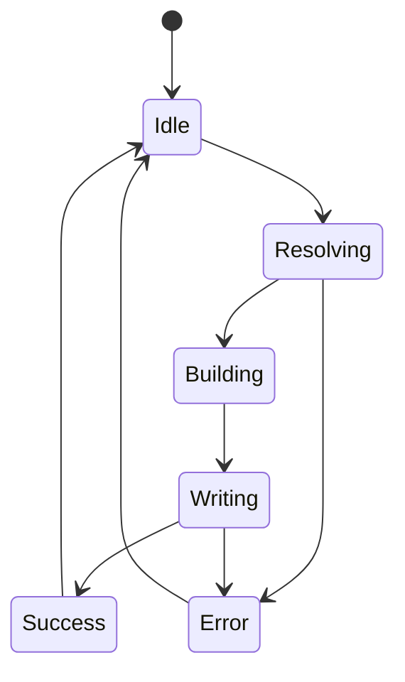

# プロジェクト用語集 (Glossary)

## 概要

このドキュメントは、プロジェクト内で使用される用語の定義を管理します。

**更新日**: 2026-10-03

## ドメイン用語

### Smart Link Copy

**定義**: SharePoint/OneDrive・Backlogの課題ページ上で右クリックした際に表示されるコンテキストメニュー項目、およびその機能名(リポジトリ名は`smart-link-copy`)

**説明**: クリックすると、**現在アドレスバーに表示されているフォルダー**の階層をパンくず形式のリッチテキストリンクとしてクリップボードにコピーする。右クリックした場所・対象は問わない(実機検証の結果、ファイル/フォルダー行の右クリック対象を検知する設計は廃止した。詳細は[[設計方針の変更]]を参照)

**関連用語**: [[パンくず]]、[[起点セグメント]]、[[設計方針の変更]]

**使用例**:
- 「■勉強会資料」フォルダーを開いた状態でページ内を右クリック→「Smart Link Copy」→Teamsに貼り付けると `マイファイル > ■勉強会資料` のように表示される
- Backlogの課題ページで実行すると、`Spring開発標準 > 課題名` と課題URLの2行がコピーされる([[Backlog課題リンク]]参照)

**英語表記**: Smart Link Copy

### 設計方針の変更

**定義**: 「右クリックされたファイル/フォルダーをDOMから検知する」設計から、「現在アドレスバーに表示されているフォルダーを常にコピー対象とする」設計への変更

**説明**: 実機検証の結果、SharePoint/OneDriveがファイル/フォルダー行の右クリックに独自のコンテキストメニューを表示し、ブラウザ標準のコンテキストメニュー(拡張機能のメニュー項目を含む)を抑制することが判明した。またDOM検知に頼った場合、無関係なUI要素(ストレージ容量アップグレードのバナー等)を誤って抽出する不具合も発生した。これを受けて`ContextTargetTracker`・`ItemInfoExtractor`(いずれも廃止済み)を削除し、URLのみを情報源とする設計に変更した

**関連用語**: [[Smart Link Copy]]

**使用例**: `docs/architecture.md`、`docs/functional-design.md`の「設計方針の変更」セクション参照

### パンくず(Breadcrumb)

**定義**: 起点(トップフォルダー)から現在表示しているフォルダーまでの階層を、` > ` で区切って連結した表示形式

**説明**: SharePointのUI上のパンくずナビゲーションと同様の考え方で、共有相手がフォルダーの位置を把握できるようにするための表示形式。起点以外の各フォルダーセグメント(現在のフォルダー自身を含む)には実際のフォルダーへのハイパーリンクが付与される

**関連用語**: [[起点セグメント]]、[[BreadcrumbSegment]]、[[BreadcrumbResult]]

**使用例**:
- `マイファイル > ■勉強会資料 > _old`

**英語表記**: Breadcrumb

### 起点セグメント(トップフォルダー)

**定義**: パンくずの先頭に表示される、階層のルートを表すラベル

**説明**: ページ自身のパンくずUI([[BreadcrumbRootLabelReader]]参照)の起点側の要素から取得する。階層が深く起点側が折りたたまれている場合は、URLベースの値を使う。
OneDriveでは「マイファイル」、SharePointチームサイトではサイト名が表示される。取得できない場合は
URLベースの値(OneDriveは「マイファイル」固定、SharePointはドキュメントライブラリ名。例: `Documents`)に
フォールバックする。起点セグメントはリンクを持たないプレーンテキストとして表示される

**関連用語**: [[パンくず]]、[[PageContext]]、[[BreadcrumbRootLabelReader]]

**使用例**:
- OneDrive: `マイファイル`
- SharePointチームサイト(サイト名取得成功時): `営業部サイト`
- SharePointチームサイト(フォールバック時): `Documents`

**英語表記**: Root Segment / Top Folder

### 選択アイテム

**定義**: SharePoint/OneDriveのリスト上で、ユーザーが選択している(`aria-selected="true"`の行の)ファイル/フォルダー

**説明**: 「Smart Link Copy」実行時、現在のフォルダーのパンくずの下に、選択アイテム名を1件1行で列挙してコピーする(ファイルの実リンクはURLから構築できないため、リンクなしのテキスト)。右クリック対象ではなく**選択状態**を読み取るため、独自コンテキストメニューの影響を受けない。右クリックで選択が解除されるUIに備え、右クリック直前にスナップショットする

**関連用語**: [[Smart Link Copy]]、[[行頭マーカー]]、[[SelectionReader]]

**使用例**:
- 2つのファイルを選択→右クリック→「Smart Link Copy」→ 2行の`　┗ ファイル名`がパンくずの下に付く

**英語表記**: Selected Items

### 行頭マーカー

**定義**: 選択アイテム名の行頭に付ける`　┗ `(全角スペース U+3000 + `┗` U+2517 + 半角スペース)

**説明**: パンくずの下にアイテムがぶら下がっていることを示すツリー表記。行頭の全角スペースはHTMLでも空白が畳み込まれない文字のため、貼り付け先(Teams/OneNote)でもインデントが維持される

**使用例**:
```
マイファイル > ◆自己紹介 > 20250108_トリセツ
　┗ 20231122_近況報告_DED_山田太郎.pptx
　┗ Cropped_Image.png
```

### SelectionReader / SelectionTracker

**定義**: `SelectionReader`は選択アイテム名をDOMから読み取る関数(`readSelectedItemNames`)。`SelectionTracker`は右クリックの`mousedown`/`contextmenu`(captureフェーズ)で選択をスナップショットして保持するクラス

**説明**: DOM構造への依存をここに閉じ込めている。名前の取得は多段のフォールバックで、失敗しても例外にせず空(選択なし)として扱う

**関連用語**: [[選択アイテム]]

### BreadcrumbRootLabelReader

**定義**: OneDrive/SharePointページ自身が表示しているパンくずUIから、起点ラベルを読み取る関数群(`readBreadcrumbLabels` / `selectRootLabel` / `readBreadcrumbRootLabel`)

**説明**: OneDrive/SharePointは共通のFluent UI製パンくずコンポーネントを使っており、各階層が
`data-automationid="breadcrumb-crumb"`という安定した自動化属性を持つ(実機のDOMキャプチャで確認済み。
ハッシュ付きのCSSクラス名とは異なり変化しにくい)。その先頭要素のテキスト(OneDriveでは「マイファイル」、
SharePointではサイト名)を読み取る。階層が深いと起点側は📁アイコン([[パンくずの折りたたみ]])に隠れるため、全ラベルをURL由来のフォルダー列と末尾から照合し、照合できなかった先頭側の余りを起点とする。見つからなければ`null`を返す(例外にせず、起点は[[起点セグメント]]の
URLベースの値のままになる)

**関連用語**: [[起点セグメント]]

**使用例**: 実際のOneDriveのパンくずDOM(`<span title="マイファイル" class="breadcrumbTextItem_...">`)から
「マイファイル」を読み取る。SharePointでは同様の構造からサイト名(例:「営業部サイト」)を読み取り、
パンくずの起点(従来は「Shared Documents」等のライブラリ名)に置き換える

### Backlog課題リンク

**定義**: Backlogの課題詳細ページで「Smart Link Copy」を実行した際にコピーされる、「プロジェクト名 > 課題名」と課題URLの2行のテキスト

**説明**: プロジェクト名はページ上部の`.header-icon-set__name`、課題名は件名欄(`[data-testid="issueSummary"]`)の`.markdown-body`、
課題URLはアドレスバーのURL(`origin + pathname`。ハッシュ・クエリは除去)から取得する。プロジェクト名が取得できない場合は
URLのプロジェクトキーで代替する。HTML形式では課題URLがハイパーリンクになる

**関連用語**: [[Smart Link Copy]]、[[課題キー]]

**使用例**:
```
Spring開発標準 > 【アプリケーション方式設計書_1はじめに.xlsx】1.1 本書の目的
https://yonespring.backlog.com/view/SPRING-3
```

**英語表記**: Backlog Issue Link

### 課題キー / プロジェクトキー

**定義**: 課題キーはBacklogの課題を一意に識別する`<プロジェクトキー>-<番号>`形式の文字列(例: `SPRING-3`)。プロジェクトキーはその前半部分(例: `SPRING`)

**説明**: 課題詳細ページのURLは`/view/<課題キー>`となる。`BacklogIssueResolver`がURLから両者を取り出す

**関連用語**: [[Backlog課題リンク]]

### BacklogIssueResolver / BacklogIssueReader / BacklogLinkBuilder

**定義**: Backlog課題リンクコピーを構成するContent Scriptのモジュール群(いずれも関数ベース)

**説明**: `BacklogIssueResolver`はURLが課題ページかを判定し`BacklogIssueContext`を返す(純粋関数)。
`BacklogIssueReader`はDOMからプロジェクト名・課題名を読む(DOM依存はここに集約。見つからなければ`null`)。
`BacklogLinkBuilder`は`ClipboardContent`(HTML/テキスト)に整形する(純粋関数)

**関連用語**: [[Backlog課題リンク]]、[[ClipboardContent]]

### パンくずの折りたたみ

**定義**: OneDrive/SharePointのパンくずUIが、階層が深いときに起点側の階層を📁アイコン(オーバーフローメニュー)にまとめて隠す挙動

**説明**: 折りたたまれた階層はメニューを開くまでDOMに描画されないため読めない。この状態で先頭の可視要素を起点とみなすと、
`■勉強会資料 > ■勉強会資料 > …`のように起点が消えて先頭フォルダーが重複する(実際に発生した不具合)

**関連用語**: [[BreadcrumbRootLabelReader]]

## 技術用語

### Chrome Extension Manifest V3

**定義**: Google Chromeの拡張機能アーキテクチャの最新仕様(Manifest V2の後継)

**公式サイト**: https://developer.chrome.com/docs/extensions/mv3/intro/

**本プロジェクトでの用途**: 拡張機能全体の実行基盤として採用。Background処理は「Service Worker」として、ページ内処理は「Content Script」として実装する

**バージョン**: 仕様バージョン3

**関連ドキュメント**: `docs/architecture.md`

### Background Service Worker

**定義**: Manifest V3の拡張機能において、常駐せずイベント駆動で起動するバックグラウンド処理の実行単位

**公式サイト**: https://developer.chrome.com/docs/extensions/mv3/service_workers/

**本プロジェクトでの用途**: `ContextMenuController` を実行し、「Smart Link Copy」コンテキストメニューの登録とクリックイベントの検知を行う

**バージョン**: -

**関連ドキュメント**: `docs/architecture.md`、`docs/repository-structure.md`

### Content Script

**定義**: 拡張機能が対象のWebページに注入し、そのページのDOM・URLへアクセスできるスクリプト

**公式サイト**: https://developer.chrome.com/docs/extensions/mv3/content_scripts/

**本プロジェクトでの用途**: SharePoint/OneDriveページの現在のURLを解析し、パンくずを構築、クリップボードへ書き込む(`FolderPathResolver` / `BreadcrumbBuilder` / `ClipboardWriter`)。DOM解析は行わない([[設計方針の変更]]参照)

**バージョン**: -

**関連ドキュメント**: `docs/functional-design.md`、`docs/repository-structure.md`

### Clipboard API

**定義**: ブラウザがクリップボードへの読み書きを提供するWeb標準API(`navigator.clipboard`)

**公式サイト**: https://developer.mozilla.org/docs/Web/API/Clipboard_API

**本プロジェクトでの用途**: `ClipboardWriter` が `navigator.clipboard.write()` を用いて、`text/html`(リッチテキスト)と`text/plain`を同時にクリップボードへ書き込む

**バージョン**: -

## 略語・頭字語

### MV3

**正式名称**: Manifest Version 3

**意味**: Chrome拡張機能の設定ファイル(`manifest.json`)の仕様バージョン3

**本プロジェクトでの使用**: `docs/architecture.md`のテクノロジースタックで採用技術として記載

### PRD

**正式名称**: Product Requirements Document

**意味**: プロダクト要求定義書

**本プロジェクトでの使用**: `docs/product-requirements.md`

## アーキテクチャ用語

### プロセス分離アーキテクチャ

**定義**: Manifest V3の制約上、拡張機能の処理が「Background Service Worker」と「Content Script」という異なる実行コンテキストに分離されるアーキテクチャパターン

**本プロジェクトでの適用**: `background/`(コンテキストメニュー管理)と`content/`(URL解析・クリップボード書き込み)を明確に分離し、両者は`chrome.tabs.sendMessage`によるメッセージング経由でのみやり取りする

**関連コンポーネント**: `ContextMenuController`、`FolderPathResolver`、`BreadcrumbBuilder`、`ClipboardWriter`

**図解**:
```
Background Service Worker (ContextMenuController)
        │ chrome.tabs.sendMessage
        ▼
Content Script (FolderPathResolver/BreadcrumbBuilder/ClipboardWriter)
        │ URL解析・クリップボード書き込み(DOM解析は行わない)
        ▼
SharePoint / OneDriveページ
```

### host_permissions

**定義**: Manifest V3で、拡張機能がアクセス可能なドメインを制限するための宣言

**本プロジェクトでの適用**: `*://*.sharepoint.com/*`・`*://onedrive.live.com/*`・`*://*.backlog.com/*`・`*://*.backlog.jp/*`・`*://*.backlogtool.com/*` のみを許可し、他ドメインへは一切アクセスしない設計とする

**関連コンポーネント**: `manifest.json`

### web_accessible_resources

**定義**: Manifest V3で、ページ側のコンテキスト(Content Script経由の動的import/fetch等)からアクセス可能な拡張機能内リソースを宣言する設定

**説明**: `content_scripts[].js`に直接指定するファイル以外を動的`import()`等で読み込む場合、この宣言が無いと読み込みが例外を投げずにサイレントに失敗する。実際にこの登録漏れにより「コンテキストメニューは表示されるがクリックしても何も起きない」不具合が発生し、修正した(`docs/architecture.md`参照)

**本プロジェクトでの適用**: `content/*.js`・`shared/*.js`を、対象サイト(SharePoint/OneDrive/Backlog)に限定して登録する

**関連コンポーネント**: `manifest.json`、`src/content/loader.ts`

## ステータス・状態

### コピー処理の状態

Smart Link Copy実行時、Content Script内部で管理される処理段階(`docs/functional-design.md`のステート図に対応)。

| ステータス | 意味 | 遷移条件 | 次の状態 |
|----------|------|---------|---------|
| Idle | 待機状態 | 初期状態 | 「Smart Link Copy」クリックでResolvingへ |
| Resolving | PageContext解析中 | 解析成功/失敗 | Building または Error へ |
| Building | BreadcrumbResult生成中 | 生成成功 | Writingへ |
| Writing | クリップボード書き込み中 | 書き込み成功/失敗 | Success または Error へ |
| Success | 処理完了 | - | Idleへ戻る |
| Error | 処理失敗 | エラートースト表示 | Idleへ戻る |

**状態遷移図**:


## データモデル用語

### BreadcrumbSegment

**定義**: パンくずを構成する1つの区切りセグメント

**主要フィールド**:
- `label`: 表示名(フォルダー名、または起点セグメントのラベル)
- `url`: リンク先URL。`null`の場合はプレーンテキスト表示(起点セグメントのみ)

**関連エンティティ**: [[BreadcrumbResult]]

**制約**: 起点セグメントは必ず `url: null`。それ以外のフォルダーセグメント(現在のフォルダー自身を含む)は必ず `url` を持つ

### PageContext

**定義**: 現在のページURLから読み取れる情報

**主要フィールド**:
- `siteType`: `'onedrive-personal'` または `'sharepoint-site'`
- `origin` / `pathname`: URLの構成要素
- `idParam`: URLの`id`クエリパラメータをデコードした値(フォルダーパス)
- `viewId`: OneDriveの`viewid`等、URL再構築時に引き継ぐ追加パラメータ

**関連エンティティ**: [[BreadcrumbSegment]]

### BreadcrumbResult

**定義**: クリップボードに書き込む最終的な内容

**主要フィールド**:
- `segments`: `BreadcrumbSegment[]`
- `selectedItems`: 選択アイテム名(表示順)。0件なら空配列
- `html`: クリップボードに書き込むHTML文字列(text/html)
- `text`: クリップボードに書き込むプレーンテキスト(text/plain、リンク情報なし)

**関連エンティティ**: [[BreadcrumbSegment]]

**制約**: 1行目の`text`は各`segment.label`を` > `で連結したもの。`html`は`url`があれば`<a href>`、無ければエスケープ済みテキストとして連結したもの。`selectedItems`がある場合は2行目以降に[[行頭マーカー]]付きでアイテム名を追加する(textは`\n`区切り、htmlは`<br>`区切り、アイテム名はリンクなし)

### ClipboardContent

**定義**: クリップボードに書き込む内容の共通形(`html` / `text`)

**説明**: `BreadcrumbResult`はこれを継承する。Backlog用の`BacklogLinkBuilder`はこの型を返し、`ClipboardWriter`はこの型を受け取る

**関連エンティティ**: [[BreadcrumbResult]]

### BacklogIssueContext / BacklogIssueLink

**定義**: `BacklogIssueContext`はBacklogの課題ページURLから読み取れる情報(`issueKey` / `projectKey` / `issueUrl`)。
`BacklogIssueLink`は整形の入力(`projectName` / `issueSummary` / `issueUrl`)

**関連エンティティ**: [[ClipboardContent]]

## エラー・例外

### BreadcrumbResolutionError

**クラス名**: `BreadcrumbResolutionError`

**発生条件**: ページURLから`PageContext`を解析できない場合(`cause: 'url-parse-failed'`)、Backlogの課題名をDOMから取得できない場合(`cause: 'backlog-issue-not-found'`)、またはクリップボードへの書き込みに失敗した場合(`cause: 'clipboard-write-failed'`)

**対処方法**: クリップボードは書き換えず、エラートースト「Smart Link Copyに失敗しました。もう一度お試しください」を表示する

**エラーコード**: なし(`cause`プロパティで種別を区別)

**例**:
```typescript
throw new BreadcrumbResolutionError('対象のフォルダー階層を解析できませんでした', 'url-parse-failed');
```

## 計算・アルゴリズム

### フォルダー階層の構築

**定義**: 現在のアドレスバーURLの`id`クエリパラメータから、起点(トップフォルダー)〜現在のフォルダーまでの各階層の名前とリンクURLを構築するアルゴリズム

**計算式**:
```
1. hostname から siteType を判定する(onedrive.live.com → onedrive-personal / *.sharepoint.com → sharepoint-site)
2. id クエリパラメータをデコードし、"/" で分割してパスセグメント配列を得る
3. siteType に応じて起点ラベルを決定する(onedrive-personal: "マイファイル" / sharepoint-site: ライブラリ名)
4. 起点より後ろの各セグメント(現在のフォルダー自身を含む)について、先頭からそのセグメントまでを連結した部分パスで
   id を差し替えたURLを生成する
```

**実装箇所**: `src/content/FolderPathResolver.ts`、`src/content/BreadcrumbBuilder.ts`

**例**:
```
入力(OneDriveのURL、「■勉強会資料」フォルダーを開いている状態):
https://onedrive.live.com/my?id=%2Fpersonal%2F00d5c5517f1d115b%2FDocuments%2F%E2%96%A0%E5%8B%89%E5%BC%B7%E4%BC%9A%E8%B3%87%E6%96%99

出力(text):
マイファイル > ■勉強会資料
```
